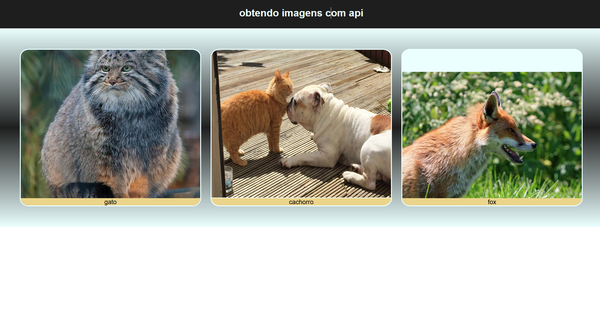
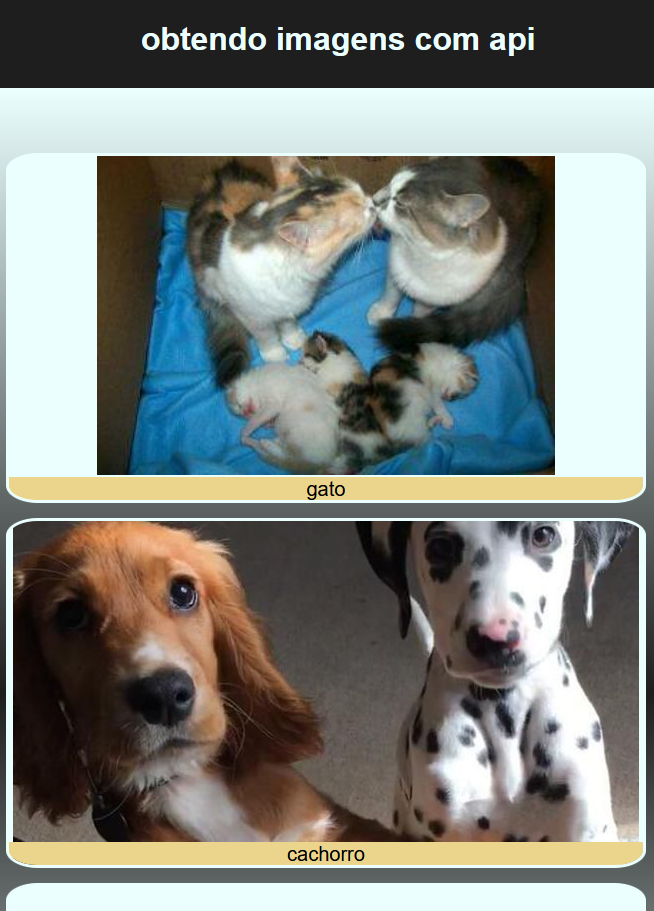
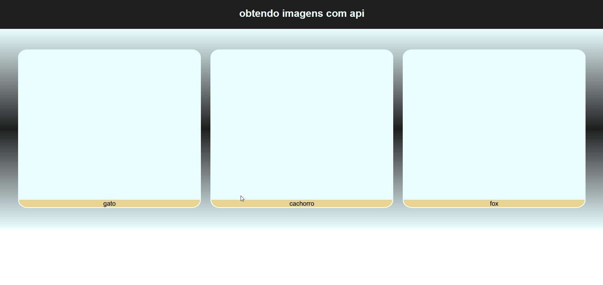

# obterImagens

obtendo imagens com APIs

<a href="https://vilmar-moreira-souza.github.io/obterImagens/" target="blank">visualizar</a>

<h3>desktop</h3>

<h3>mobile</h3>

<h3>gif</h3>

<h3>sobre a aplicação</h3>

essa aplicação busca imagens aleatorias de gato, cachorro e lobo atraves de APIs  

<a href="https://vilmar-moreira-souza.github.io/obterImagens/" target="blank">visualizar </a>

<h3>ideias para implementar</h3>

 <li>melhorar o design</li>
<li> padronizar o tamanho das imagens mostradas</li>
<li> adicionar mais detalhes a pequisa</li>
<li> adicionar outras categorias como carros,casas,etc...</li>
<li> mais...</li>

<h3>bugs e problemas</h3>

<li>as imagens sao exibidas de forma desproporcional.  </li>
<li>o tempo de resposta é inadequado-lento. </li>
<li>não ha um padrao das imagens-resolução.  </li>
<li>as imagens podem ser gifs ou formatos nao adequados.    </li>
